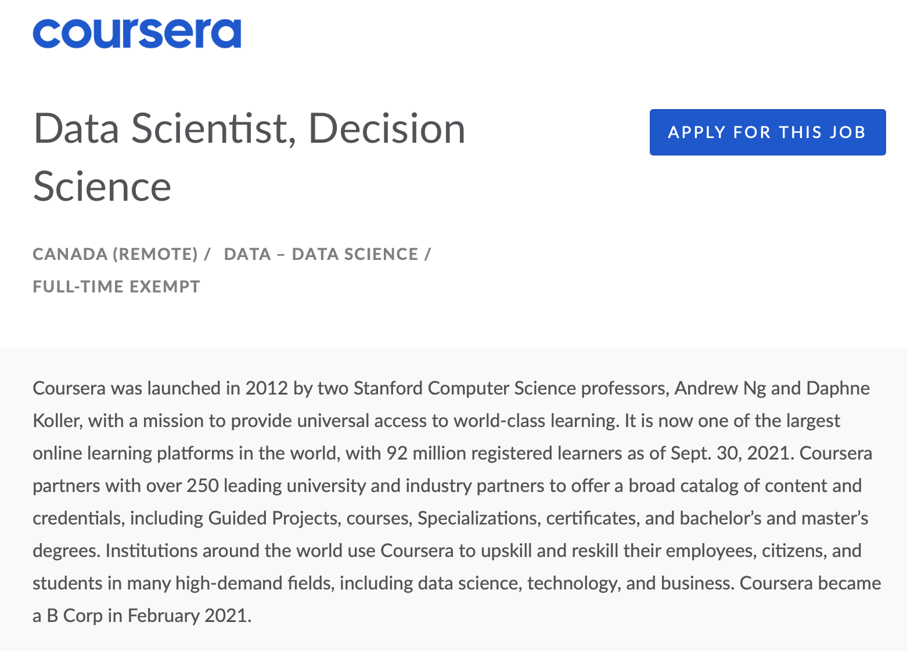
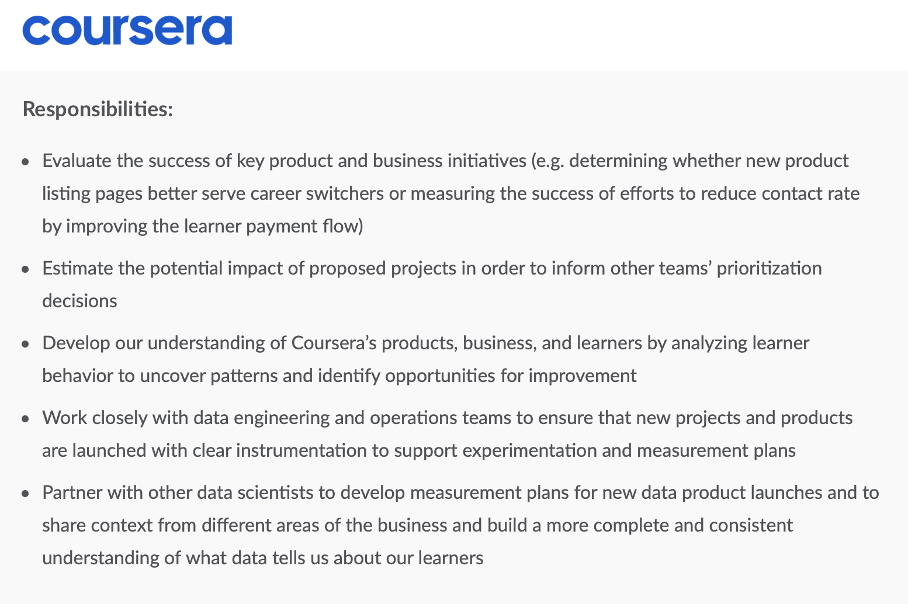
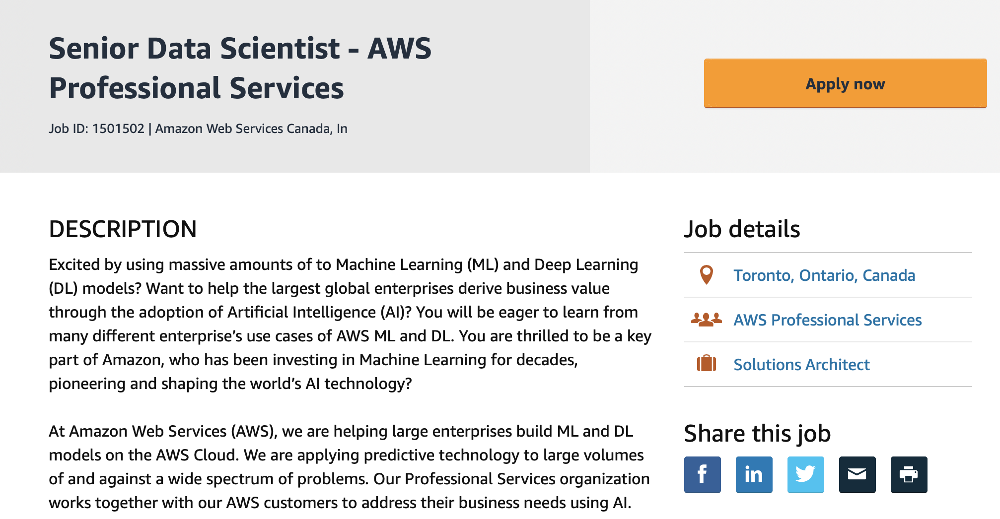
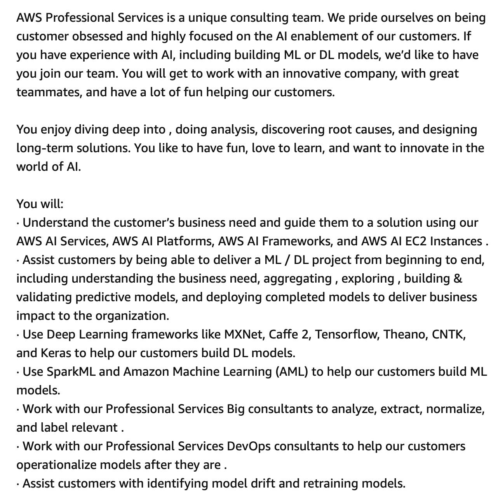
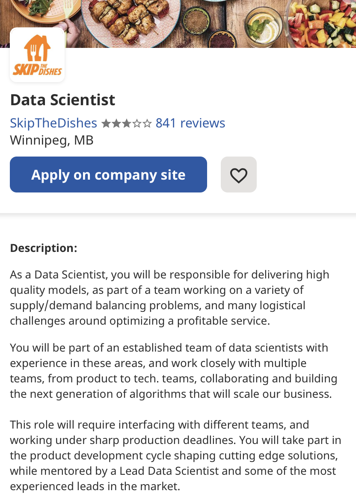
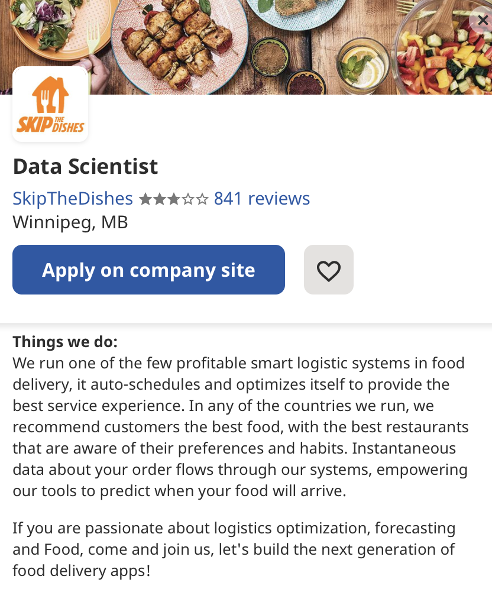

# Task 1: Data Science Careers
### Job 1: Data Scientist, Decision Science - Coursera 
[Job Link](https://jobs.lever.co/coursera/8d31d02f-ef6b-4021-9a29-11a727192762)
Coursera is one of the largest online learning platforms in the world offering all types of courses, Guided Projects, Specializations, certificates and degrees to millions of users. The company partners with over 250 university and leading partners to provide a broad catalog of learning resources. I personally am a huge fan of learning platforms such as Coursera because they give people the opportunity and the access to resources to learn things on their own, in their own time, and allows for credentials that are highly sought after. The Data Science team helps build the future of education through data-driven decision making. I'm interested in the job posting because the role gives you the chance to work on a product that is useful to others and help make it better using data-driven evaluations. 

Job Posting: 

### Job 2: Senior Data Scientist - AWS Professional Services 
[Job Link](https://www.amazon.jobs/en/jobs/1501502/senior-data-scientist-aws-professional-services)
AWS Professional Services is a unique consulting team in Amazon Web Services. They help their customers build solutions using the AWS Cloud Resources. I personally interned at AWS last summer and I enjoy using their products - I believe that they are the leading cloud provider for many businesses around the world and have a variety of different tools. Being a Data Scientist on the AWS Professional Services team means being able to work on projects with clients that revolve around data science, machine learning and articial intelligence, which I believe is very interesting. 

Job Posting: 

### Job 3: Data Scientist - Skip the Dishes
[Job Link](https://careers.justeattakeaway.com/global/en/job/R_017235/Data-Scientist?utm_source=indeed&utm_medium=earned_jobposting&utm_campaign=Data%20%26%20Analytics_CA_Winnipeg&utm_term=Data%20Scientist&utm_content=Winnipeg)
Skip the Dishes is a Canadian online restaurant ordering and food delivery service, which we know is a competitor with Doordash and Uber Eats. As a person who uses food delivery services quite often, I think that being able to work at a company like Skip the Dishes as a data scientist would be a great opportunity to learn about the logistical and data modelling side when it comes to optimizing and profitable service. It would be also be really cool to measure and analyze the kind of data that a company like this would collect, such as the kind of food people like to order, average delivery times, etc. 

Job Posting: 

# Task 2: Highs and Lows

Insert any comments, or just NA